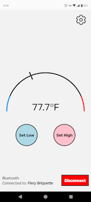

# fiery_briquette

A Bluetooth grill thermometer app that pairs with an Arduino.

- Developed using React Native (TypeScript) and Arduino's custom C++.
- Connects through Bluetooth to an Arduino running the associated code.
- Monitors temperatures received from the Arduino to keep the user constantly updated through a dynamic visual temperature dial.
- Allows the user to specify high and low temperatures. Sends alerts when the temperature leaves this range.
- Supports background operation, continuing to monitor temperatures and send alerts while the app is minimized.
